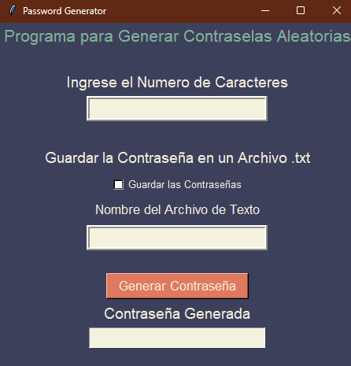

# Generador de Contraseñas en Python

Este proyecto es un generador de contraseñas aleatorias implementado en Python con una interfaz de usuario amigable. Permite generar contraseñas aleatorias y guardarlas en un archivo de texto.

## Características

- **Generación de contraseñas**: El programa puede generar contraseñas aleatorias.
- **Guardado de contraseñas**: El programa puede guardar las contraseñas generadas en un archivo de texto para su posterior uso.
- **Interfaz de usuario**: El programa cuenta con una interfaz de usuario intuitiva para facilitar la interacción.

## Estructura del Proyecto

El proyecto consta de los siguientes archivos:

- `password_generator.py` : Este es el archivo principal que contiene todo el código del generador de contraseñas.

## Requisitos

Para ejecutar este programa, necesitarás tener instalado Python en tu sistema. Puedes descargarlo desde la página oficial de Python.

## Licencia

Este proyecto está bajo la licencia MIT. Consulta el archivo `LICENSE` para obtener más detalles.

-----------------------------------------

# Python Password Generator

This project is a random password generator implemented in Python with a user-friendly interface. It allows you to generate random passwords and save them in a text file.

## Features

- **Password Generation**: The program can generate random passwords.
- **Password Saving**: The program can save the generated passwords in a text file for later use.
- **User Interface**: The program has an intuitive user interface to facilitate interaction.

## Project Structure

The project consists of the following files:

- `password_generator.py`: This is the main file that contains all the code for the password generator.

## Requirements

To run this program, you will need to have Python installed on your system. You can download it from the official Python page.

## License

This project is under the MIT license. See the `LICENSE` file for more details.

-----------------------------------------

 

